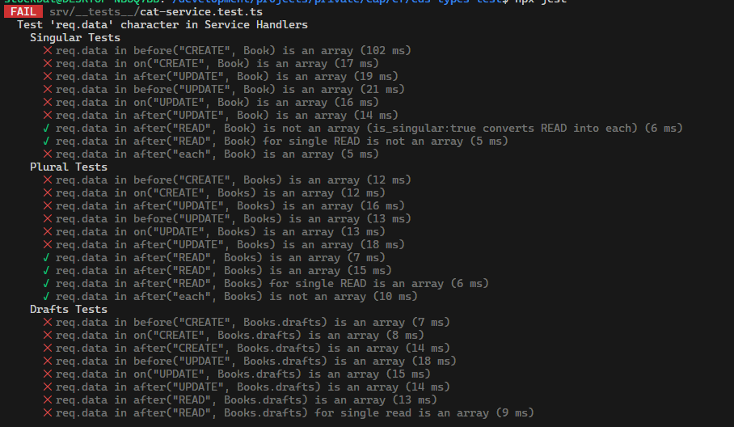

# Testing @cap-js/cds-types

Simple CAP project to verify/test the generated types from [@cap-js/cds-types](https://github.com/cap-js/cds-types) in a CAP project
together with [@cap-js/cds-typer](https://github.com/cap-js/cds-typer).

Currently the `.before`, `.on` and `.after` handlers are being tested to see if the handler parmater `req.data` or `data` is of the correct class according to the type inference from cds-typer.

## Handler type inference test results

