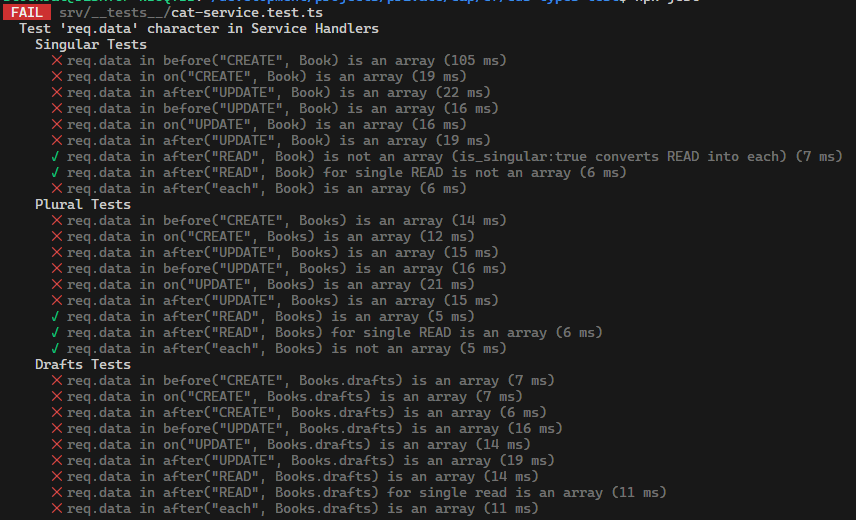

# Testing @cap-js/cds-types

Simple CAP project to verify/test the generated types from [@cap-js/cds-types](https://github.com/cap-js/cds-types) in a CAP project
together with [@cap-js/cds-typer](https://github.com/cap-js/cds-typer).

Currently the `.before`, `.on` and `.after` handlers are being tested to see if the handler parmater `req.data` or `data` is of the correct class according to the type inference from cds-typer.

## Used CDS versions

| Module                 | Version  |
| ---------------------- | -------- |
| @cap-js/asyncapi       | 1.0.2    |
| @cap-js/cds-typer      | 0.24.0   |
| @cap-js/cds-types      | 0.6.3    |
| @cap-js/openapi        | 1.0.4    |
| @cap-js/sqlite         | 1.7.3    |
| @sap/cds               | 8.0.4    |
| @sap/cds-compiler      | 5.0.6    |
| @sap/cds-dk (global)   | 8.0.3    |
| @sap/cds-fiori         | 1.2.7    |
| @sap/cds-foss          | 5.0.1    |
| @sap/cds-mtxs          | 2.0.3    |
| @sap/eslint-plugin-cds | 3.0.4    |
| Node.js                | v18.20.2 |

## Handler type inference test results

